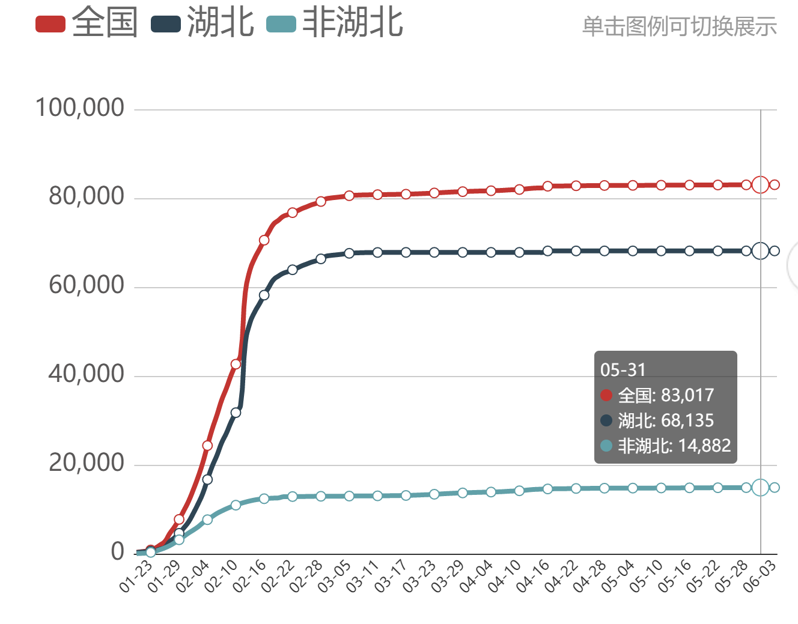
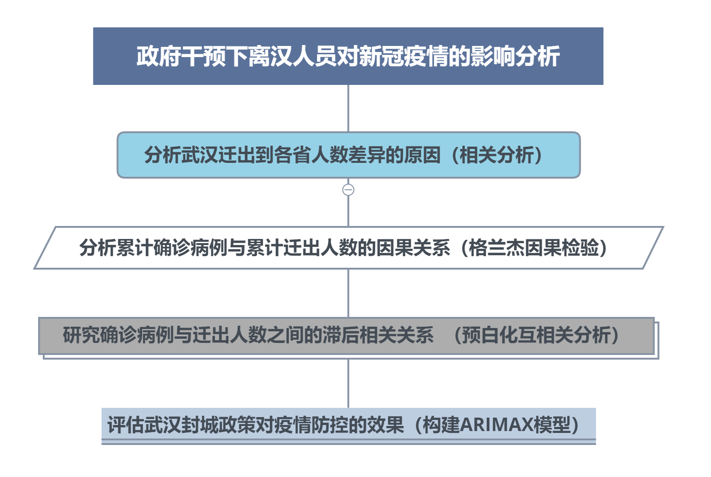

## **展示内容**

### **1. 绪论**

### **2. 描述性统计分析**

### **3. 实证分析**

### **4. 总结**

# 1. 绪论

## 1. 绪论

### **1.1 选题背景及意义**

### **1.2 文献综述**

### **1.3 研究思路与结构**

### **1.4 数据来源与预处理**

## **1.1 选题背景**
这次新冠肺炎疫情，是新中国成立以来在我国发生的传播速度最快、感染范围最广、防控难度最大的一次重大突发公共卫生事件。  
 
疫情的快速蔓延伴随着显著的人传人特性，较长的潜伏期特性和潜在较大规模的人口流动特性。  
 
为有效防制疫情的传播，中央采取强有力的干预政策，于2020年1月23日对武汉进行全面封城。  
 
本文主要通过分析疫情初期离汉人员对其他30个省市自治区新冠病例的影响，来评估武汉封城这一政策干预对疫情防控的效果。

## **1.1 选题意义**

原因分析：  
1. 最初爆发点在湖北武汉  2. **武汉封城政策的干预效果** 

## **1.2 文献综述**
* COVID-19在中国传播的趋势分析  林华珍教授团队(2020)    
主要运用疫情病例数据和交通运输数据建立时间序列模型，评估各省公共干预对新冠病例传播率的影响。

* 武汉迁出交通量与中国COVID-19发病率的时间关系分析  方亚、石再兴(2020)  
运用互相关分析、arimax模型，研究交通量和疫情发病率的相关关系，评估武汉封城令对新冠疫情累计发病率的影响。

* 新冠状病毒肺炎、人口迁移与疫情扩散防控  杨华磊、吴远洋和蔺雪钰(2020)  
运用SIR模型分析人口迁徙对新冠病毒感染人数的影响。  

* 人口迁入与新增确诊数的趋势关系及因果量化分析  廖可等(2020)  
运用格兰杰因果检验分析迁入指数与新增病例数之间的因果关系。

* 厦门市新冠肺炎传播能力计算与防控措施效果的模拟评估  陈田木等(2020)    
通过构建SEIAR模型拟合厦门市新冠肺炎的有效再生数，评估厦门市政府综合干预的防控效果。

## **1.3 研究思路与结构**

## **1.4 数据来源及预处理**
* 2020年1月10日至2月29日的各省新增新冠疫情确诊病例数据来源于维基百科  
 
* 同期武汉疫情数据来源于武汉卫健委官网  
 
* 2020年1月10日至2月29日武汉每日迁出数据来源于百度地图迁徙大数据平台  

<big>**每日武汉迁出到各省人数=每日迁徙规模指数×每日迁出到各省的百分比×44520**</big>
   
  
* 各省GDP和各省年末人口数来自2019年中国统计年鉴  
  
* 武汉到各省的交通量用12306官网中单日武汉到各省省会城市的火车趟数表示   
  
* 武汉到各省的距离用百度地图中武汉到各省省会城市的距离表示
