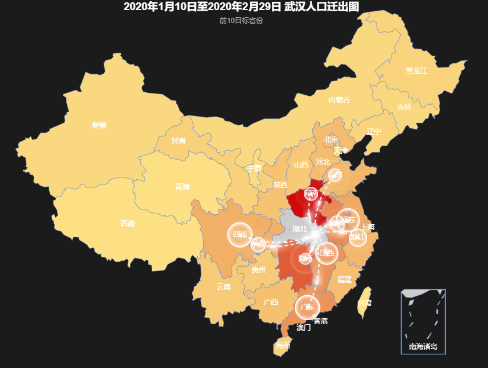
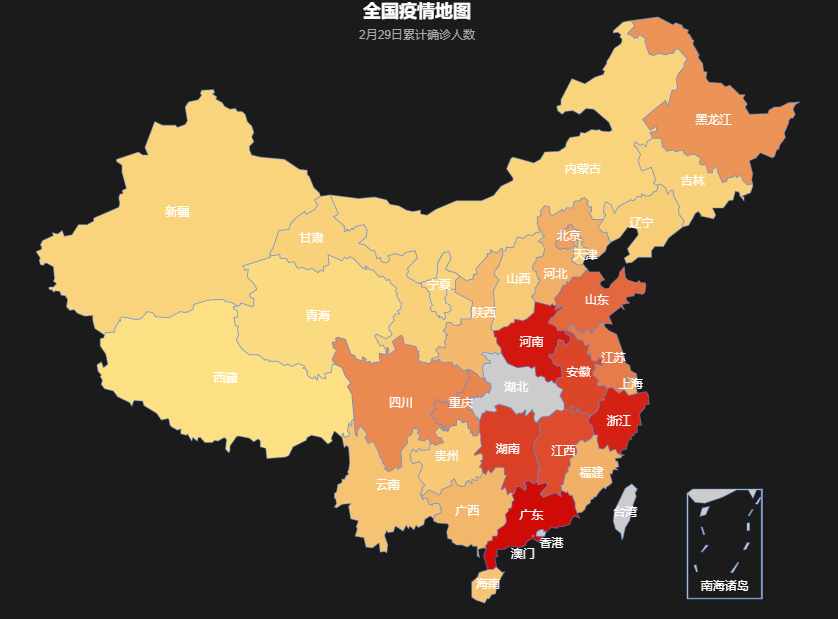
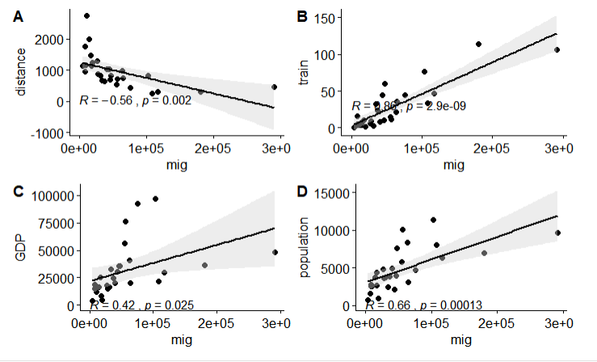
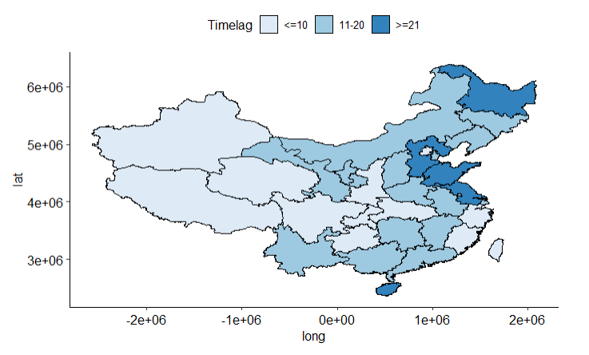
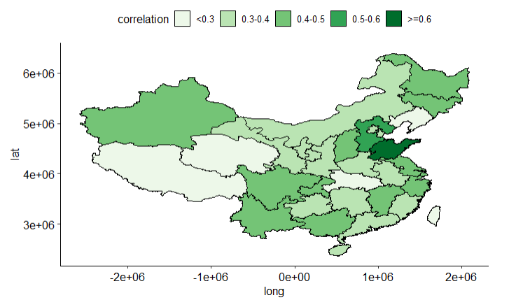
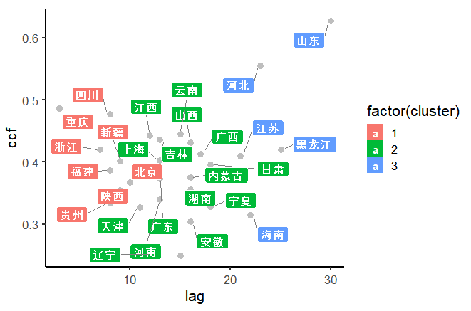

# 2. 描述性统计分析

## **2.1 武汉人口迁出趋势**
<div align=center></div>

## **2.2 全国累计确诊情况**
<div align=center></div>

## **2.3 相关关系**
```{r,eval=FALSE,echo=FALSE,error=FALSE,message=FALSE}
data<-read.csv("new_correlation.csv")
attach(data)
library(ggplot2)
library(ggpubr)
library(rstatix)
library(ggpmisc)
theme_set(ggpubr::theme_pubr()+
            theme(legend.position = "top"))
library(ggpubr)
p1<- ggscatter(data, x = "mig", y = "distance",color = "black",
          add = "reg.line",conf.int = TRUE,    
          add.params = list(fill = "lightgray")
)+
  stat_cor(method = "pearson", 
           label.x = 3, label.y = 30)
p2<- ggscatter(data, x = "mig", y = "train",color = "black",
          add = "reg.line",conf.int = TRUE,    
          add.params = list(fill = "lightgray")
)+
  stat_cor(method = "pearson", 
           label.x = 3, label.y = 30)
p3<- ggscatter(data, x = "mig", y = "GDP",color = "black",
          add = "reg.line",conf.int = TRUE,    
          add.params = list(fill = "lightgray")
)+
  stat_cor(method = "pearson", 
           label.x = 3, label.y = 30)
p4<- ggscatter(data, x = "mig", y = "population",color = "black",
          add = "reg.line",conf.int = TRUE,    
          add.params = list(fill = "lightgray")
)+
  stat_cor(method = "pearson", 
           label.x = 3, label.y = 30)
ggarrange(p1,p2,p3,p4,ncol=2,nrow=2,labels=c("A","B","C","D"))
```
<div align=center></div>

# 3. 实证分析

## **3.1 格兰杰因果检验**

|  原假设   |  P值 | 检验结果   |
|:----------:|:--------:|:----------:|
|case does not Granger Cause mig|0.9807|不拒绝|
|mig does not Granger Cause case|0.0184|拒绝|

## **3.2 互相关分析**
```{r,eval=FALSE,echo=FALSE,error=FALSE, message=FALSE}
library(jsonlite)
library(rjson)
library(RJSONIO)
library(ggplot2)
library(RColorBrewer)
library(lubridate)
library(plyr)
library(dplyr)
library(rgdal)
library(sf)
library(geojsonio)
library(sp)
library(ggthemes)
x<-readOGR("省级行政区.shp",stringsAsFactors=FALSE,encoding="UTF-8")
prov_map<-fortify(x)
map=read.csv("map.csv")
totalp=data.frame(id=map$id,pnum=map$lag,
                  Timelag=cut(map$lag,breaks=c(0,11,21,30),
                              labels=c("<=10","11-20",">=21"),
                              order = TRUE,include.lowest = T,right = F))
ttp<-merge.data.frame(prov_map,totalp,by.prov_map="id",by.totalp="id")
ggplot()+
        geom_polygon(data=ttp,aes(x=long,y=lat,group=group,
                                  fill=Timelag),colour="black",size=0.25)+
        scale_fill_manual(values = brewer.pal(3,"Blues"))
```
<div align=center></div>

## **3.2 互相关分析**
```{r,eval=FALSE,echo=FALSE,error=FALSE, message=FALSE}
library(jsonlite)
library(rjson)
library(RJSONIO)
library(ggplot2)
library(RColorBrewer)
library(lubridate)
library(plyr)
library(dplyr)
library(rgdal)
library(sf)
library(geojsonio)
library(sp)
library(ggthemes)
x<-readOGR("省级行政区.shp",stringsAsFactors=FALSE,encoding="UTF-8")
prov_map<-fortify(x)
map=read.csv("map.csv")
totalp1=data.frame(id=map$id,pnum=map$ccf,
                   correlation=cut(map$ccf,breaks=c(0,0.3,0.4,0.5,0.6,1),
                                   labels=c("<0.3","0.3-0.4","0.4-0.5","0.5-0.6",">=0.6"),
                                   order = TRUE,include.lowest = T,right = F))

ttp1<-merge.data.frame(prov_map,totalp1,by.prov_map="id",by.totalp1="id")

ggplot()+
        geom_polygon(data=ttp1,aes(x=long,y=lat,group=group,
                                   fill=correlation),colour="black",size=0.25)+
        scale_fill_manual(values = brewer.pal(5,"Greens"))
```
<div align=center></div>

## **3.2 互相关分析**
<div align=center></div>