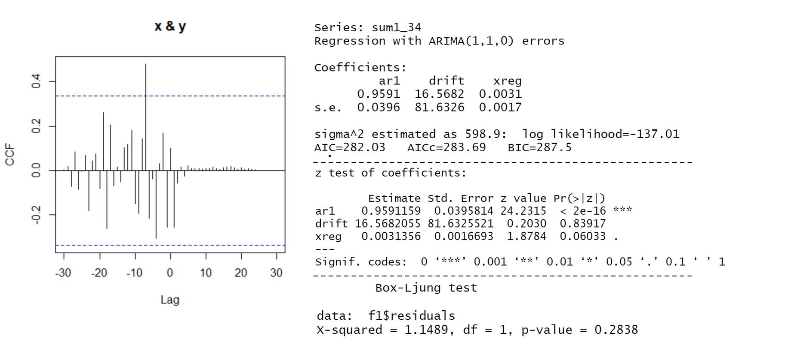
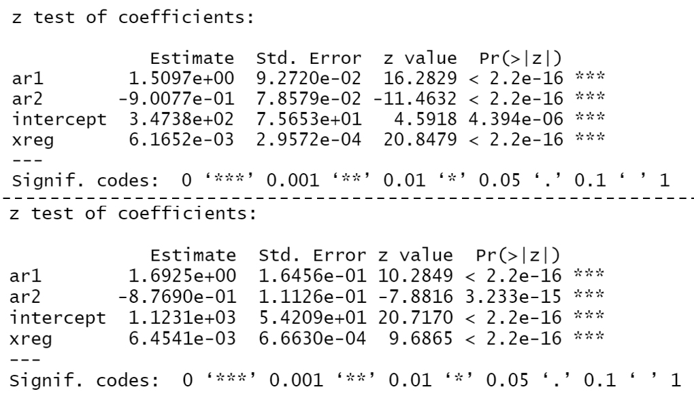
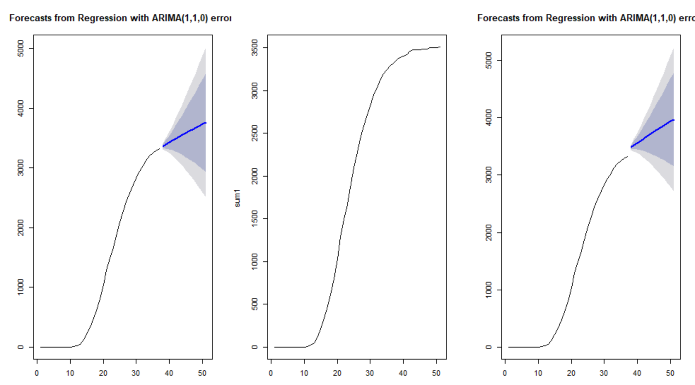
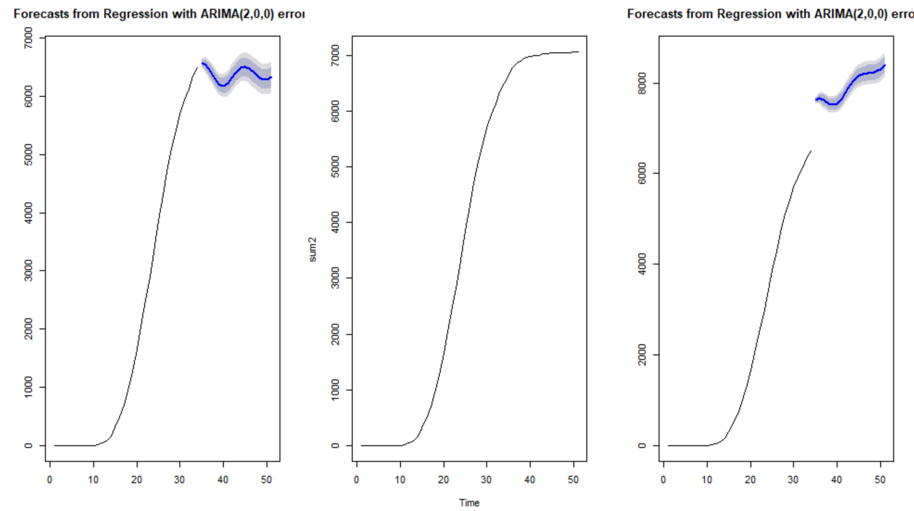
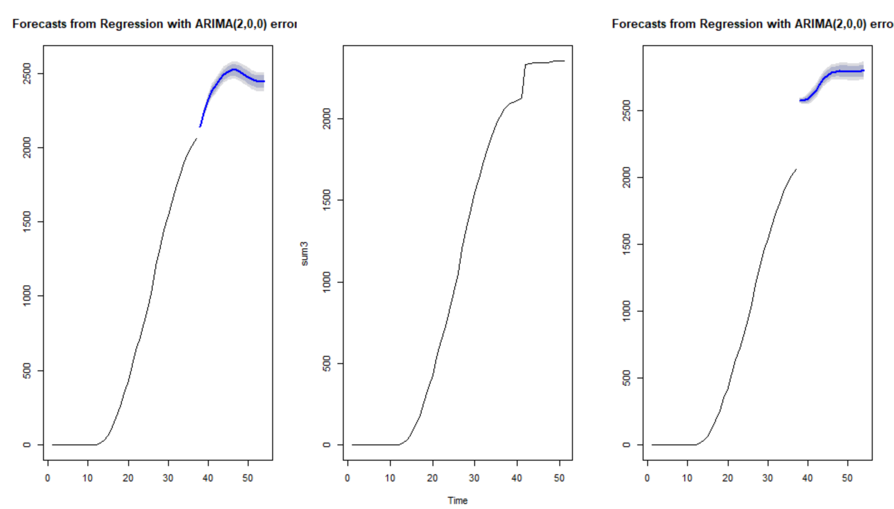

# 3.实证分析

## **3.3 ARIMAX模型**
&emsp;&emsp;ARIMAX模型，是在对变量协整关系研究的基础上将时间序列分析与多元回归分析结合提出得一种模型。它是在ARIMA模型的基础上引入解释变量，建立了附带解释变量的ARIMA模型，也称扩展的ARIMA模型，从而提高时间序列的预测精度。ARIMAX模型可表示为：  
$$y_{t} = \beta x_{t}+n_{t} $$ 
$$n_{t}=\mu+\alpha_1y_{t-1}+\alpha_2y_{t-2} + ...+\alpha_py_{t-p}\\-\theta_1\varepsilon_{t-1}-\theta_2\varepsilon_{t-2}-...-\theta_p\varepsilon_{t-p}$$
其中，$\mu$是常数项，$\alpha_i$(1,2,...,p)和$\varepsilon_i$(1,2,...,p)为待估的参数，$\varepsilon_p$为方差为$\sigma^2$的白噪声过程，X是引入的解释变量，$\beta$为其待估的参数。  

## **3.3 ARIMAX模型--平稳性检验**

|  类别   | Dickey-Fuller |  p-value   |  结果  |
|:-------:|:------------:|:------:|:-----:|
|  第一类   |   -3.8212    | 0.0298 |   平稳  |
|  第二类   |   -4.6805    | <0.01 |   平稳  | 
|  第三类   |   -3.6175    | 0.0453 |   平稳  |  

可以看出，在5%的显著性水平下，数据通过了平稳性检验

## **3.3 ARIMAX模型--分析过程**

## **3.3 ARIMAX模型--三集群模型信息**

|滞后阶数 | Model  |  RMSE  |  MAE   |  AIC  |  BIC  |百分比|
|:-------:|:------:|:------:|:------:|:-----:|:-----:|:-----:|
|  1-10   | (1,1,0)|25.66   | 20.26  |282.03 |287.5  |29%|
|  11-20  | (2,0,0)|51.18   | 41.87  |207.09 |211.54  |53%|
|  20以上 | (2,0,0)|12.85   | 10.37  |102 |103.99  |18%|

## **3.2 ARIMAX模型--第一集群预测**

  

2月29日，预测出疫情人数是3759人，95%的置信区间是2501到5018人，真实值是3507人，用去年同期数据预测为3972人，95%的置信区间是2712到5230人。

## **3.2 ARIMAX模型--第二集群预测**

  

2月29日，预测出疫情人数是6335人，95%的置信区间疫情人数是6064到6607人，真实值是7053人，用去年同期数据预测为8409人，95%的置信区间是8138到8680人。

## **3.2 ARIMAX模型--第三集群预测**

  

2月29日，预测出疫情人数是2441人，95%的置信区间疫情人数是2375到2407人，真实值是2353人，用去年同期数据预测为2805人，95%的置信区间是2739到2872人。
 

# 4.总结  

## **4 总结**
### 结论
1、离武汉的距离、火车趟数、GDP和各省人口数四个指标均与武汉迁到各省的人口呈现出相关关系，其中距离呈现出负相关关系，其余三个指标均与武汉迁到各省人口呈现出正相关关系。  
2、利用ARIMAX模型，三集群省份武汉封城令可能分别减少465、1356和452人，一共会减少2273(95%置信区间:679，3869)例一代病例，故武汉封城令是有效减少疫情传播的方式之一。  

### 建议
1、由于疫情的重要传染源之一是湖北迁移到各省的人口，迁移量与各省经济水平相关，故应重点防控那些比湖北经济状况好的省份，例如广东和浙江。  

### 不足
1、诊断能力和标准的变化可能导致疫情发病率的趋势变化。  
2、模型未加入湖北非武汉地区的预测情况。