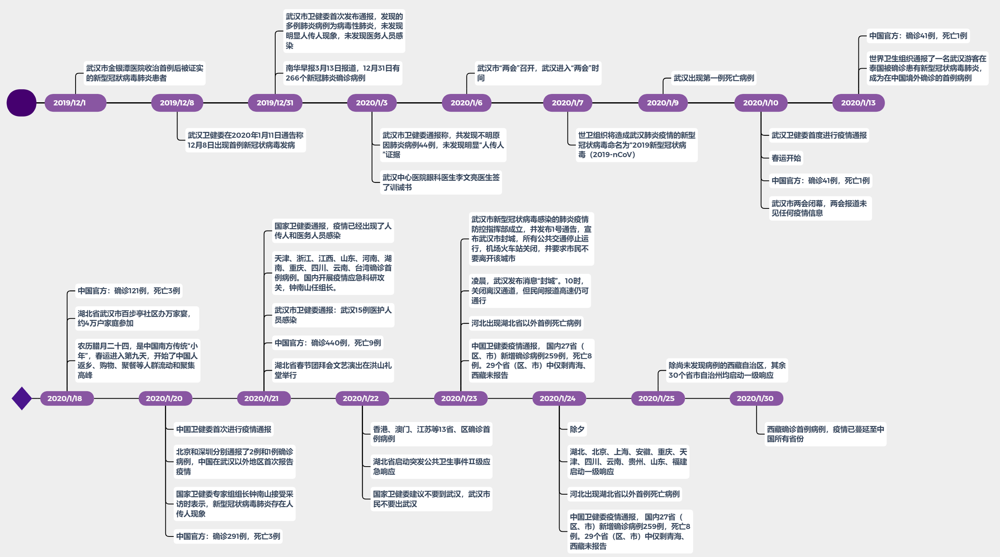
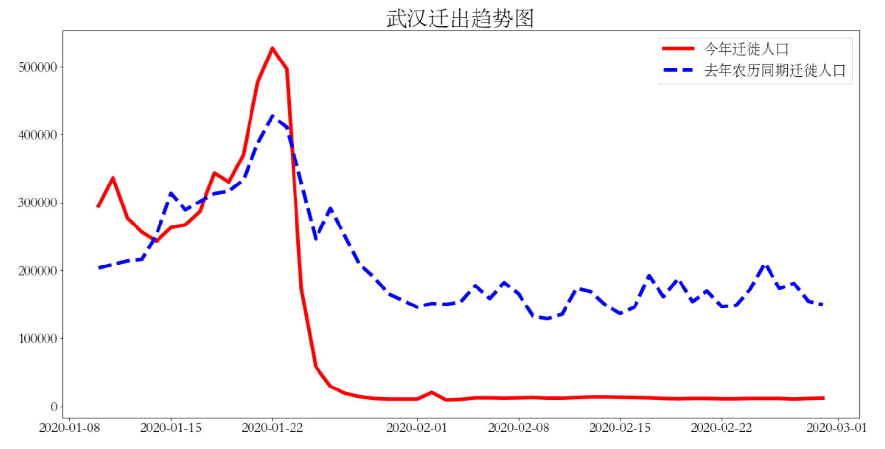
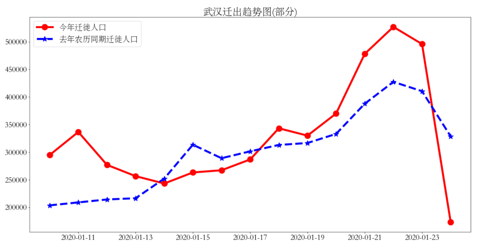
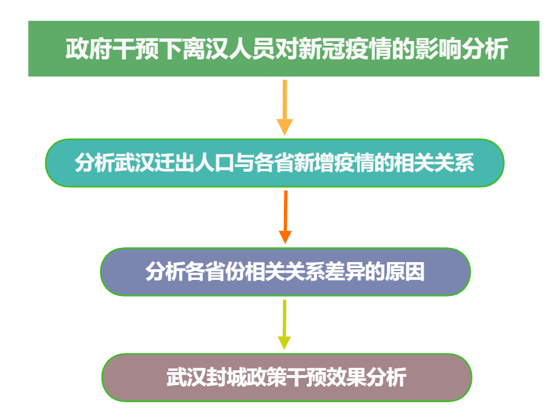

## **展示内容**

### **1.绪论**

### **2.理论分析—CCF介绍**

### **3.现阶段成果及展望**

# 1. 绪论

## 1.绪论

### **1.1 选题背景**

### **1.2 研究思路**

## **1.1 选题背景**

## **1.1 选题背景**

## **1.1 选题背景**

2019新型冠状病毒肺炎于2019年12月在湖北省武汉市出现，其显著的人传人特性伴随着高密度的人口流动导致病毒迅速蔓延，构成了全球突发公共卫生事件。为有效防控疫情，武汉于2020年1月23日下达封城令，离汉通道全部关闭。  
 
由于疫情初期，正值中国大规模迁徙的春运时期，武汉作为中国中部交通和工业的枢纽,人流量巨大，上百万群众在封城令实施前已离开武汉，大量潜伏的新冠病毒也随着这上百万的离汉人员分散到全国各地，因此我们初步认为大量武汉人员的迁出对中国其他地区的疫情传播存在影响。  
 
本次研究旨在分析疫情初期离汉人员与其他30个省市自治区疫情的相关关系，同时评估武汉封城这一政策干预对疫情发展的效果。  
 

<big>**大量潜伏确诊病例+大量离汉人员→离汉人员对其他各省疫情产生影响**</big>

## **1.2 研究思路**

