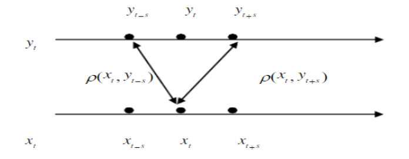

## **互相关函数**
自相关  
&ensp;&ensp;&ensp;&ensp;自相关，也称为序列相关，是一个信号于其自身在不同时间点的互相关。
$$
R(s,t)=\frac{E[(X_{s}-\mu_{s})(X_{t}-\mu_{t})]}{\sigma_{s}\sigma_{t}}
$$
   
互相关函数  
&ensp;&ensp;&ensp;&ensp;互相关函数是一种非常有用的测度两个变量之间相关强度和方向的函数，在时间序列中我们常常讨论两个变量间的相关性，它与平稳时间序列的自相关函数不同，自相关函数没有方向，亦即$X_{t}$与$X_{s}$的自相关系数只与时间间隔有关。

## **互相关函数**
&ensp;&ensp;&ensp;&ensp;如果给定两个时间序列$x_{t}$和$y_{t}$，且均为平稳时间序列，则称
$$
cov(y_{t},x_{s})=E[(y_{t}-\mu_{y})(x_{s}-\mu_{x})]
$$
为互协方差函数。
$$
\rho(y_{t},x_{s})=\frac{E[(y_{t}-\mu_{y})(x_{s}-\mu_{x})]}{\sigma_{x}\sigma_{y}}
$$
为互相关函数，记为CCF。

## **互相关函数**

$$
\rho(x_{t},y_{t-s})=\frac{E[(x_{t}-\mu_{x})(y_{t-s}-\mu_{y})]}{\sigma_{x}\sigma_{y}}=\rho_{xy}(-s) 
$$
$$
\rho(x_{t},y_{t+s})=\frac{E[(x_{t}-\mu_{x})(y_{t+s}-\mu_{y})]}{\sigma_{x}\sigma_{y}}=\rho_{xy}(s)
$$

## **样本互相关函数**
&ensp;&ensp;&ensp;&ensp;由于总体的互相关函数是未知的，为了讨论两个时间序列的互相关函数，通常用一个跨度为n的样本来估计总体互相关函数，假设这个跨度为n的样本为$(x_1,y_1),(x_2,y_2),……(x_n,y_n)$。样本的互协方差函数为：
$$
\gamma_{xy}(k)=\left\{
\begin{aligned}
\frac 1n \sum_{t=1}^{n-k} (x_t-\overline{x})(y_{t+k}-\overline{y})       &      & k=0,1,2,...\\
\frac 1n \sum_{t=1}^{n+k} (y_t-\overline{y})(x_{t-k}-\overline{x})     &      & k=0,-1,-2,...\end{aligned}
\right.
$$
样本的互相关系数为
$$
\hat\rho_{xy}(k)=\frac{\gamma_{xy}(k)}{S_xS_y}             
$$

## **预白化**
预白化（pre-whitening)  
&ensp;&ensp;&ensp;&ensp;CCF受x变量的时间序列结构以及x和y序列随时间的任何“共同”趋势的影响。   &ensp;&ensp;&ensp;&ensp;解决这一难题的一种方法称为“预白化”。这些步骤是：  
&ensp;&ensp;&ensp;&ensp;1.确定x变量的时间序列模型，并存储该模型的残差。  
&ensp;&ensp;&ensp;&ensp;2.使用x变量模型（使用步骤1中的估计系数）过滤y变量序列。在这一步中，我们发现基于x变量模型的观测y值与“估计” y值之间的差异。  
&ensp;&ensp;&ensp;&ensp;3.检查步骤1的残差和步骤2的y值之间的CCF 。  

