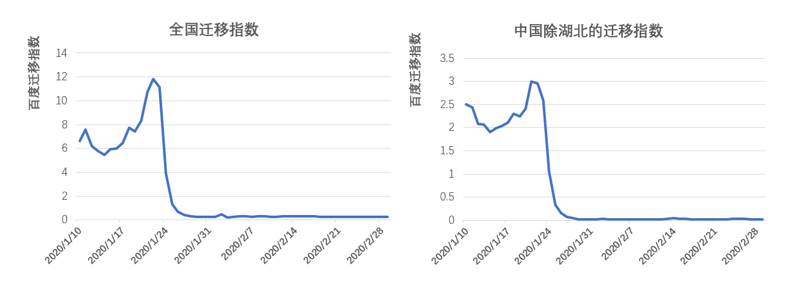
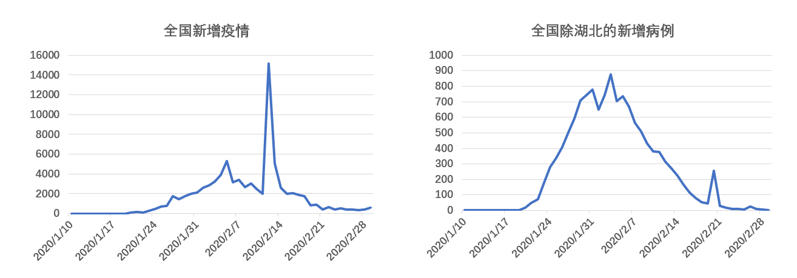
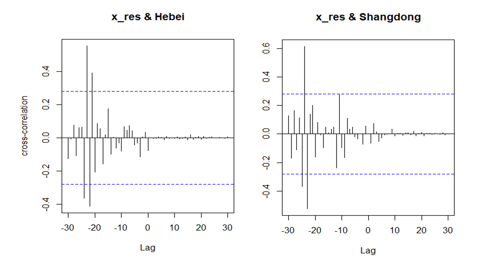

 
## **3.1 描述统计**
<div align=center></div>

从1月10日至2月29日，迁移指数分两个阶段：  

1月10日-1月23日：春运开始，从武汉向外流动的人数逐步攀升  

1月23日之后：封城开始，迁移人数发生骤降

## **3.1 描述统计**
<div align=center></div>

2月13日：诊疗方案增加临床诊断病例  

2月20日：外来输入病例小反弹


## **3.2 CCF函数**


|  省份   | ARIMA(q,d,p) |  AR1   |  MA1  |
|:-------:|:------------:|:------:|:-----:|
|  河北   |   (1,1,0)    | 0.5094 |   --  |
|  山东   |   (0,2,1)    |    --  |-0.8868|  


(1-0.5094B) (1-B) ($x_{t}$-$\mu$) = $w_{t}$  

(1-0.5094B) (1-B) $y_{t}$ = (1-1.5094B+0.5094$B^2$) $y_{t}$  

$(1-B)^2$ ($x_{t}$-$\mu$) =  $w_{t}$    

$(1-B)^2$ $y_{t}$ - 0.8868$e_{t}$

## **3.2 CCF函数**
<div align=center></div>

## **3.3 结果展示**  
```{r ,include = FALSE}
library(jsonlite);library(rjson);library(RJSONIO)
library(ggplot2);library(RColorBrewer);library(lubridate)
library(plyr);library(dplyr);library(rgdal)
library(sf);library(geojsonio);library(sp);library(ggthemes)
x<-readOGR("./data/省级行政区.shp",stringsAsFactors=FALSE,encoding="UTF-8")
prov_map<-fortify(x)
des_map=read.csv("./data/des_map.csv")
totalp=data.frame(id=des_map$id,pnum=des_map$lag,
                  Timelag=cut(des_map$lag,breaks=c(0,8,15,22,35),
                  labels=c("<7","8-14","15-21",">=22"),
                  order = TRUE,include.lowest = T,right = F))
ttp<-merge.data.frame(prov_map,totalp,by.prov_map="id",by.totalp="id")
```

```{r ,echo=FALSE,eval=T}
ggplot()+
  geom_polygon(data=ttp,aes(x=long,y=lat,group=group,
                            fill=Timelag),colour="black",size=0.25)+
  scale_fill_manual(values = brewer.pal(4,"Blues"))
```  

10%的省份的的滞后期在一周以内，45%的省份滞后期在1-2周；  
32%的省份的滞后期为2-3周，13%的省份滞后期在3周以上。

## **3.3 结果展示**  
```{r ,echo=FALSE,eval=T}
totalp1=data.frame(id=des_map$id,pnum=des_map$ccf,
                  correlation=cut(des_map$ccf,breaks=c(0,0.3,0.4,0.5,0.6,1),
                  labels=c("<0.3","0.3-0.4","0.4-0.5","0.5-0.6",">=0.6"),
                  order = TRUE,include.lowest = T,right = F))

ttp1<-merge.data.frame(prov_map,totalp1,by.prov_map="id",by.totalp1="id")

ggplot()+
  geom_polygon(data=ttp1,aes(x=long,y=lat,group=group,
                            fill=correlation),colour="black",size=0.25)+
  scale_fill_manual(values = brewer.pal(5,"Greens"))
```


## **3.3 结果展示**  
```{r ,echo=FALSE,eval=T}
totalp2=data.frame(id=des_map$id,pnum=des_map$ncov19,
                  numcov=cut(des_map$ncov19,breaks=c(0,10,100,1000,10000,100000),
                  labels=c("<10","10-100","100-1000","1000-10000",">=10000"),
                  order = TRUE,include.lowest = T,right = F))

ttp2<-merge.data.frame(prov_map,totalp2,by.prov_map="id",by.totalp2="id")

ggplot()+
  geom_polygon(data=ttp2,aes(x=long,y=lat,group=group,
                            fill=numcov),colour="black",size=0.25)+
  scale_fill_manual(values = brewer.pal(5,"Reds"))
```

## **3.3 结果展示**  
```{r ,echo=FALSE,eval=T}
library(ggplot2); library(ggrepel)

data <- read.csv("./data/plot.csv")
ggplot(data)+ geom_point(aes(lag, ccf), color="grey", size=3)+
  geom_label_repel(aes(lag, ccf, fill=factor(Province.cluster), 
                       label=id), fontface="bold", color="white", 
                   box.padding=unit(0.35, "lines"), point.padding=unit(0.5, "lines"), 
                   segment.colour = "grey50")+ theme_classic(base_size = 16)
```

## **3.4 展望**  

1、利用迁移数据和疫情数据建立ARIMAX模型。    

2、根据2019年同期的迁移数据，预测2月底的累计患病人数，进而评估武汉封城的政策效应。  

3、分析造成不同省份不同时滞性和不同互相关系数的原因，考虑引入各省GDP、人口密度、距离武汉的地理距离等因素。