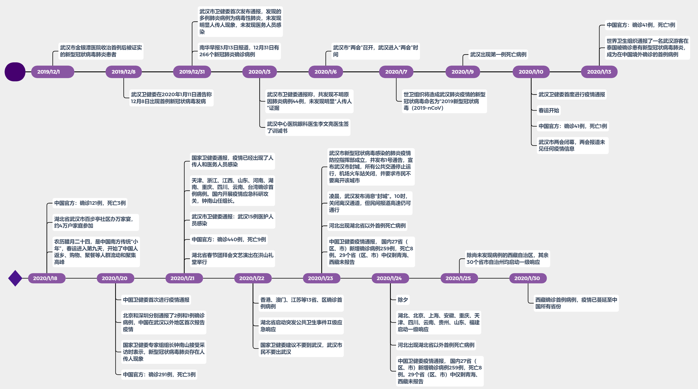
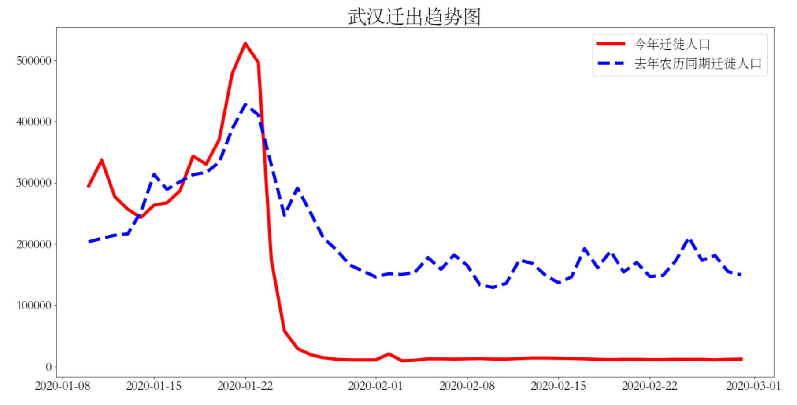
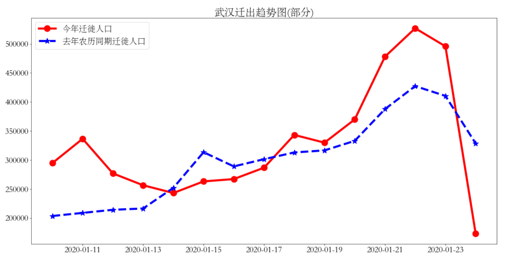
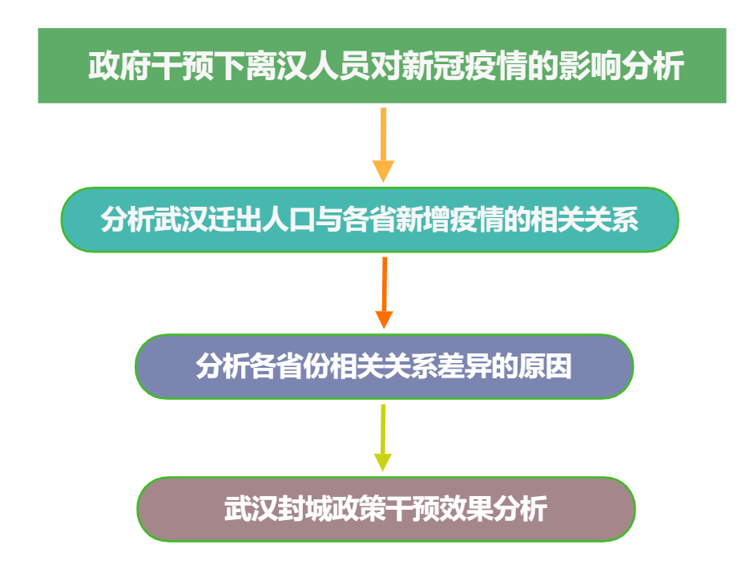
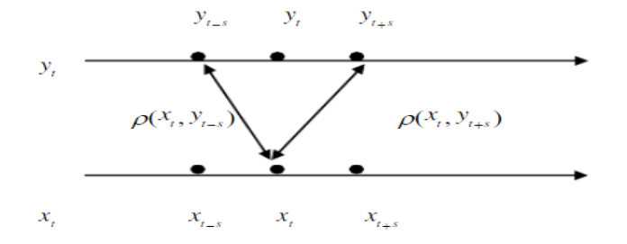
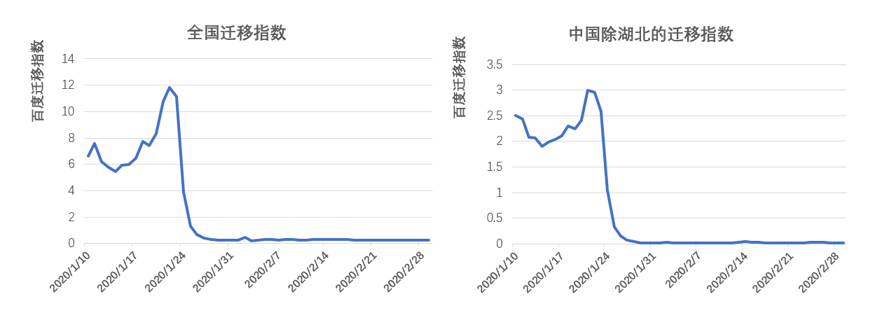
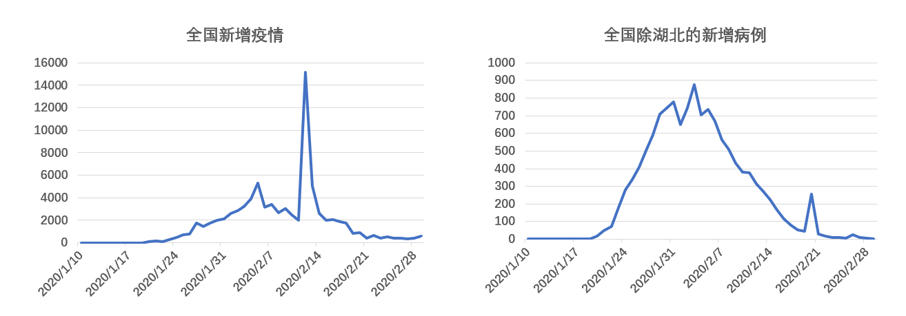
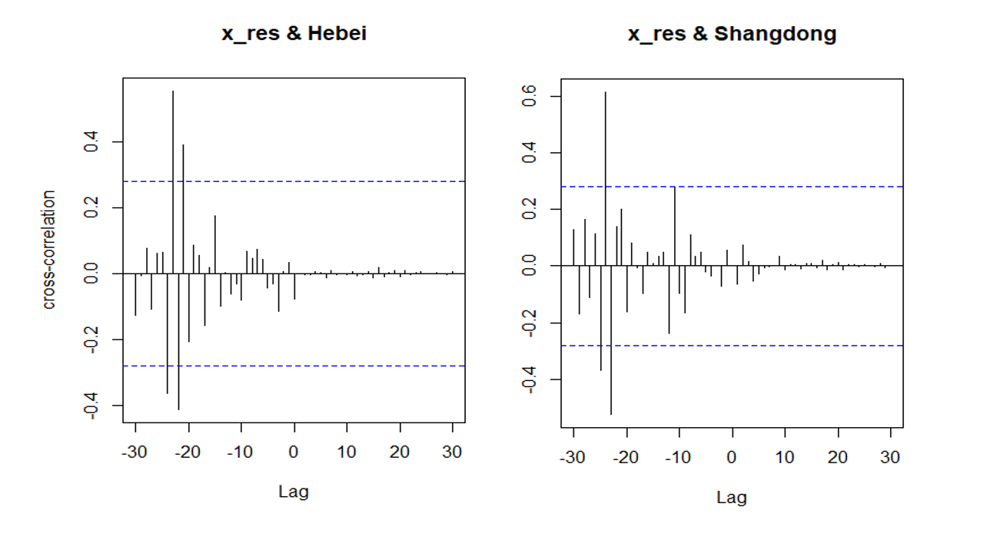

## **展示内容**

### <font size=6>**1.绪论**</font>

### <font size=6>**2.理论分析—CCF介绍**</font>

### <font size=6>**3.现阶段成果及展望**</font>


# 1. 绪论

## 1.绪论

### <font size=6>**1.1 选题背景**</font>

### <font size=6>**1.2 研究思路**</font>

## **1.1 选题背景**
<div align=center></div>

## **1.1 选题背景**
<div align=center></div>
<div align=center></div>


## **1.1 选题背景**

2019新型冠状病毒肺炎于2019年12月在湖北省武汉市出现，其显著的人传人特性伴随着高密度的人口流动导致病毒迅速蔓延，构成了全球突发公共卫生事件。为有效防控疫情，武汉于2020年1月23日下达封城令，离汉通道全部关闭。  
<br/>
由于疫情初期，正值中国大规模迁徙的春运时期，武汉作为中国中部交通和工业的枢纽,人流量巨大，上百万群众在封城令实施前已离开武汉，大量潜伏的新冠病毒也随着这上百万的离汉人员分散到全国各地，因此我们初步认为大量武汉人员的迁出对中国其他地区的疫情传播存在影响。  
<br/>
本次研究旨在分析疫情初期离汉人员与其他30个省市自治区疫情的相关关系，同时评估武汉封城这一政策干预对疫情发展的效果。  
<br/>
<center><big>**大量潜伏确诊病例+大量离汉人员→离汉人员对其他各省疫情产生影响**</big></center>


## **1.2 研究思路**
<div align=center></div>


# 2.CCF介绍

## **互相关函数**
自相关  
&ensp;&ensp;&ensp;&ensp;自相关，也称为序列相关，是一个信号于其自身在不同时间点的互相关。
$$
R(s,t)=\frac{E[(X_{s}-\mu_{s})(X_{t}-\mu_{t})]}{\sigma_{s}\sigma_{t}}
$$
   
互相关函数  
&ensp;&ensp;&ensp;&ensp;互相关函数是描述随机信号$x_{t}$和$y_{t}$在任意两个不同时刻s,t的取值之间的相关程度，是一种非常有用的测度两个变量之间相关强度和方向的函数，在时间序列中我们常常讨论两个变量间的相关性，它与平稳时间序列的自相关函数不同，自相关函数没有方向，亦即$X_{t}$与$X_{s}$的自相关系数只与时间间隔有关。

## **互相关函数**
&ensp;&ensp;&ensp;&ensp;如果给定两个时间序列$x_{t}$和$y_{t}$，且均为平稳时间序列，则称
$$
cov(x_{t},y_{s})=E[(x_{t}-\mu_{x})(y_{s}-\mu_{y})]
$$
为互协方差函数。
$$
\rho(x_{t},y_{s})=\frac{E[(x_{t}-\mu_{x})(y_{s}-\mu_{y})]}{\sigma_{x}\sigma_{y}}
$$
为互相关函数，记为CCF。

## **互相关函数**
<div align=center></div>
$$
\rho(x_{t},y_{t-s})=\frac{E[(x_{t}-\mu_{x})(y_{t-s}-\mu_{y})]}{\sigma_{x}\sigma_{y}}=\rho_{xy}(-s) 
$$
$$
\rho(x_{t},y_{t+s})=\frac{E[(x_{t}-\mu_{x})(y_{t+s}-\mu_{y})]}{\sigma_{x}\sigma_{y}}=\rho_{xy}(s)
$$
&ensp;&ensp;例如：$x_{t}$：某种商品的广告费&ensp;&ensp;$y_{t}$：该种商品的销售额

## **样本互相关函数**
&ensp;&ensp;&ensp;&ensp;由于总体的互相关函数是未知的，为了讨论两个时间序列的互相关函数，通常用一个跨度为n的样本来估计总体互相关函数，假设这个跨度为n的样本为$(x_1,y_1),(x_2,y_2),……(x_n,y_n)$。样本的互协方差函数为：
$$
\gamma_{xy}(k)=\left\{
\begin{aligned}
\frac 1n \sum_{t=1}^{n-k} (x_t-\overline{x})(y_{t+k}-\overline{y})       &      & k=0,1,2,...\\
\frac 1n \sum_{t=1}^{n+k} (y_t-\overline{y})(x_{t-k}-\overline{x})     &      & k=0,-1,-2,...\end{aligned}
\right.
$$
样本的互相关系数为
$$
\hat\rho_{xy}(k)=\frac{\gamma_{xy}(k)}{S_xS_y}             
$$

## **预白化**
预白化（pre-whitening)  
&ensp;&ensp;&ensp;&ensp;CCF受x变量的时间序列结构以及x和y序列随时间的任何“共同”趋势的影响。   &ensp;&ensp;&ensp;&ensp;解决这一难题的一种方法称为“预白化”。这些步骤是：  
&ensp;&ensp;&ensp;&ensp;1.确定x变量的时间序列模型，并存储该模型的残差。  
&ensp;&ensp;&ensp;&ensp;2.使用x变量模型（使用步骤1中的估计系数）过滤y变量序列。在这一步中，我们发现基于第2步得到的y序列与原始 y值之间存在差异。  
&ensp;&ensp;&ensp;&ensp;3.计算步骤1的残差和步骤2的y值之间的CCF 。  


# 3.现阶段结果及展望

## **3.1 描述统计**
<div align=center></div>

从1月10日至2月29日，迁移指数分两个阶段：  

1月10日-1月23日：春运开始，从武汉向外流动的人数逐步攀升  

1月23日之后：封城开始，迁移人数发生骤降

## **3.1 描述统计**
<div align=center></div>

2月13日：诊疗方案增加临床诊断病例  

2月20日：外来输入病例小反弹


## **3.2 CCF函数**


|  省份   | ARIMA(q,d,p) |  AR1   |  MA1  |
|:-------:|:------------:|:------:|:-----:|
|  河北   |   (1,1,0)    | 0.5094 |   --  |
|  山东   |   (0,2,1)    |    --  |-0.8868|  


(1-0.5094B) (1-B) ($x_{t}$-$\mu$) = $w_{t}$  

(1-0.5094B) (1-B) $y_{t}$ = (1-1.5094B+0.5094$B^2$) $y_{t}$  

$(1-B)^2$ ($x_{t}$-$\mu$) =  $w_{t}$    

$(1-B)^2$ $y_{t}$ - 0.8868$e_{t}$

## **3.2 CCF函数**
<div align=center></div>

## **3.3 结果展示**  
```{r ,include = FALSE}
library(jsonlite);library(rjson);library(RJSONIO)
library(ggplot2);library(RColorBrewer);library(lubridate)
library(plyr);library(dplyr);library(rgdal)
library(sf);library(geojsonio);library(sp);library(ggthemes)
x<-readOGR("./data/省级行政区.shp",stringsAsFactors=FALSE,encoding="UTF-8")
prov_map<-fortify(x)
des_map=read.csv("./data/des_map.csv")

totalp=data.frame(id=des_map$id,pnum=des_map$lag,
                  Timelag=cut(des_map$lag,breaks=c(0,8,15,22,35),
                  labels=c("<7","8-14","15-21",">=22"),
                  order = TRUE,include.lowest = T,right = F))

ttp<-merge.data.frame(prov_map,totalp,by.prov_map="id",by.totalp="id")
```

```{r ,echo=FALSE,eval=T}
ggplot()+
  geom_polygon(data=ttp,aes(x=long,y=lat,group=group,
                            fill=Timelag),colour="black",size=0.25)+
  scale_fill_manual(values = brewer.pal(4,"Blues"))
```  

10%的省份的的滞后期在一周以内，45%的省份滞后期在1-2周；  
32%的省份的滞后期为2-3周，13%的省份滞后期在3周以上。

## **3.3 结果展示**  
```{r ,echo=FALSE,eval=T}
totalp1=data.frame(id=des_map$id,pnum=des_map$ccf,
                  correlation=cut(des_map$ccf,breaks=c(0,0.3,0.4,0.5,0.6,1),
                  labels=c("<0.3","0.3-0.4","0.4-0.5","0.5-0.6",">=0.6"),
                  order = TRUE,include.lowest = T,right = F))

ttp1<-merge.data.frame(prov_map,totalp1,by.prov_map="id",by.totalp1="id")

ggplot()+
  geom_polygon(data=ttp1,aes(x=long,y=lat,group=group,
                            fill=correlation),colour="black",size=0.25)+
  scale_fill_manual(values = brewer.pal(5,"Greens"))
```


## **3.3 结果展示**  
```{r ,echo=FALSE,eval=T}
totalp2=data.frame(id=des_map$id,pnum=des_map$ncov19,
                  numcov=cut(des_map$ncov19,breaks=c(0,10,100,1000,10000,100000),
                  labels=c("<10","10-100","100-1000","1000-10000",">=10000"),
                  order = TRUE,include.lowest = T,right = F))

ttp2<-merge.data.frame(prov_map,totalp2,by.prov_map="id",by.totalp2="id")

ggplot()+
  geom_polygon(data=ttp2,aes(x=long,y=lat,group=group,
                            fill=numcov),colour="black",size=0.25)+
  scale_fill_manual(values = brewer.pal(5,"Reds"))
```

## **3.3 结果展示**  
```{r ,echo=FALSE,eval=T}
library(ggplot2); library(ggrepel)

data <- read.csv("./data/plot.csv")
ggplot(data)+ geom_point(aes(lag, ccf), color="grey", size=3)+
  geom_label_repel(aes(lag, ccf, fill=factor(Province.cluster), 
                       label=id), fontface="bold", color="white", 
                   box.padding=unit(0.35, "lines"), point.padding=unit(0.5, "lines"), 
                   segment.colour = "grey50")+ theme_classic(base_size = 16)
```

## **3.4 展望**  

1、利用迁移数据和疫情数据建立ARIMAX模型。    

2、根据2019年同期的迁移数据，预测2月底的累计患病人数，进而评估武汉封城的政策效应。  

3、分析造成不同省份不同时滞性和不同互相关系数的原因，考虑引入各省GDP、人口密度、距离武汉的地理距离等因素。